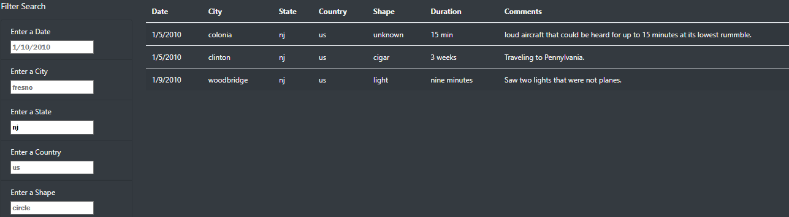

# UFO Sightings Dynamic Web Application Using JavaScript, HTML, CSS

## Overview

The goal of this project was to create a web application which incorporated a dynamic table of information which could be filtered by the user on 
multiple criteria. The table contains information regarding a collection of UFO sightings. The criteria in which the user can filter on are date, city, state, country and shape. In addition to the table, the application will have other elements which will be formatted using HTML and CSS.  

## Results

Javascript was used to accomplish the dynamic filtering of the table based on user input. An input box was created for each criteria (date, city, state, country, shape). When an input box experiences a "change", the filter is saved and applied to the table data which will then update dynamically. The "change" allows for any number of the input boxes to be changed by the user and the table updates accordingly. For example, see below where the table was only filtered by state, "nj" for New Jersey. Please also notice the input boxes also have placeholders to let the user know the proper format of input.

## Summary
